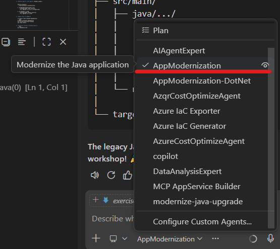

# Exercise 1: Java Tournament Service Modernization 🏆

**Duration**: 30 minutes  
**Difficulty**: ⭐⭐⭐ Intermediate  
**Prerequisites**: Java 17+, Maven 3.8+, GitHub Copilot enabled

## 🎮 The Challenge

The **Tournament Service** is the backbone of Game Arena Legends. It handles tournament creation, player registration, bracket generation, and match scheduling. Built in 2018 with Spring Boot 2.7, it's showing its age:

- 🐌 Blocking I/O operations causing slow response times during peak traffic
- 📦 Outdated dependencies with known security vulnerabilities
- 🔧 Missing observability for production debugging
- ⚠️ No support for reactive programming patterns

Your mission: **Modernize this service to handle 10x the current traffic using Spring Boot 3.2 and reactive patterns.**


## 🚀 Getting Started

### Step 1: Clone & Setup

```bash
git clone https://github.com/CanarysPlayground/app-modernization-workshop.git
cd app-modernization-workshop
cd legacy-code/java-tournament-service
```

### Step 2: Verify Setup

```bash
java -version
mvn -version
```

Ensure you have:
- **Java 17+** installed → [Download JDK 17+](https://adoptium.net/temurin/releases/)
- **Maven 3.8+** installed → [Download Maven](https://maven.apache.org/download.cgi)
- **GitHub Copilot extensions** active in VS Code:
  - [GitHub Copilot Chat](https://marketplace.visualstudio.com/items?itemName=GitHub.copilot-chat)
  - [GitHub Copilot App Modernization - Java Upgrade](https://marketplace.visualstudio.com/items?itemName=vscjava.vscode-java-upgrade)

### Step 3: Build Legacy Code

```bash
mvn clean install
mvn spring-boot:run
```

Test the API in another terminal:
```bash
curl http://localhost:8080/api/tournaments
```

## 🔧 Step-by-Step Guide

### Step 1: Use Copilot for Assessment (4 minutes)

1. **Open the project in VS Code:**
```bash
cd legacy-code/java-tournament-service
code .

```
2. **GitHub Copilot App Modernization - Java Upgrade**

   Open extension and search for  "GitHub Copilot App Modernization - Java Upgrade". Install if you haven't already.

   

3. **Select the Right Model for Assessment:**

   Click the Copilot icon → **Model Selector** → Choose:
   - **GPT-4** for comprehensive analysis (recommended for assessment)
   - **Claude 3.5 Sonnet** for alternative perspective

4. **Use Copilot Chat for Assessment:**

   Open Copilot Chat (`Ctrl+Alt+I` or `Cmd+Alt+I`) and ask:
   ```
   @workspace Analyze this Spring Boot project. What version is it using? What needs to be upgraded for Spring Boot 3.2? Identify deprecated dependencies and breaking changes.
   ```

   The analysis will cover:
   - Current framework versions
   - Deprecated dependencies
   - Breaking changes (javax→jakarta)
   - Reactive patterns recommendations
   - Migration steps

4. **Use Custom agent AppModernization**



### Step 2: Upgrade and Verify (10 minutes)

**Upgrade the application:**

Open `pom.xml` and use Copilot to upgrade:
```
Upgrade to Spring Boot 3.2.0 with Java 17, add reactive web (webflux) and data (r2dbc) dependencies
```

**Expected Results:**

Copilot automatically transforms:
- ✅ Spring Boot 2.3 → 3.2, Java 11 → 17
- ✅ `javax.*` → `jakarta.*`
- ✅ Controllers/Services/Repositories → Reactive (`Flux`/`Mono`)
- ✅ `JpaRepository` → `ReactiveCrudRepository`

**Quick Verification:**

```bash
# Compile and test
mvn clean test

# Verify reactive patterns
grep -r "Mono\|Flux" src/main/java/

# Run application
mvn spring-boot:run

# Test endpoint
curl http://localhost:8080/api/tournaments
```

## ✅ Success Criteria

Your modernization is complete when:

- [ ] Application starts successfully on port 8080
- [ ] All endpoints return data reactively (Mono/Flux)
- [ ] No blocking I/O in controllers or services (grep check passes)
- [ ] All generated tests pass (`mvn test`)
- [ ] Build completes successfully with `mvn clean install`

## 🎯 Validation Commands

```bash
# Build and test
mvn clean test

# Check for blocking code (should return no results)
grep -r "block()" src/main/java/

# Verify reactive patterns
grep -r "Mono\|Flux" src/main/java/

# Start application
mvn spring-boot:run
```

## 🐛 Troubleshooting

### Issue 1: Compilation errors after Spring Boot 3 upgrade
**Solution**: Ensure all javax.* imports are replaced with jakarta.*
```bash
find src -name "*.java" -exec sed -i 's/javax\./jakarta./g' {} +
```

### Issue 2: R2DBC connection failures
**Solution**: Check R2DBC URL format and ensure PostgreSQL is running
```bash
docker run -d -p 5432:5432 -e POSTGRES_PASSWORD=postgres postgres:15
```

### Issue 3: Tests failing with WebTestClient
**Solution**: Add `@WebFluxTest` annotation and mock repositories
```java
@WebFluxTest(TournamentController.class)
class TournamentControllerTest {
    @MockBean
    private TournamentService service;
    
    @Autowired
    private WebTestClient webClient;
}
```

## 🎓 Key Takeaways

1. **Copilot's Cascading Intelligence** - ONE comprehensive prompt can trigger complete stack transformations
2. **Understanding Context Matters** - "Reactive web + data" tells Copilot to convert entire stack
3. **Model Selection** - Choose the right model for analysis and transformation tasks
4. **@workspace Context** - Analyzes entire project structure before suggesting changes
5. **Verification Over Creation** - Modern workflows: verify Copilot's work > manual coding
6. **Test Generation** - WebTestClient for reactive endpoints with comprehensive test coverage
7. **Spring Boot 3.x** - Requires Java 17+ and Jakarta EE namespace (Copilot handles automatically)
8. **Reactive Patterns** - Flux (0..N), Mono (0..1), proper error handling
9. **Modernization Acceleration** - Copilot reduces migration time by 80%+ vs manual approach

## 📚 Additional Resources

- [Spring Boot 3.0 Migration Guide](https://github.com/spring-projects/spring-boot/wiki/Spring-Boot-3.0-Migration-Guide)
- [Spring WebFlux Documentation](https://docs.spring.io/spring-framework/reference/web/webflux.html)
- [Project Loom (Virtual Threads)](https://openjdk.org/projects/loom/)
- [GitHub Copilot for Java](https://docs.github.com/en/copilot/tutorials/modernize-java-applications)

## 🚀 Next Steps

Congratulations! You've modernized the Tournament Service. Choose your path:

### Option A: Deploy to Azure (Optional)
**[Exercise 1.1: Azure Deployment with Copilot CLI →](exercise-1.1-java-cli.md)**
- Learn Copilot CLI automation
- Deploy to Azure Spring Apps with PostgreSQL
- Use custom agents and MCP servers
- **Duration**: 25 minutes

### Option B: Continue with .NET Modernization
**[Exercise 2: .NET API Modernization →](exercise-2-dotnet.md)**
- Migrate .NET Framework 4.8 → .NET 8
- Convert to minimal APIs and EF Core
- **Duration**: 30 minutes

> **💡 Tip**: Exercise 1.1 is optional but highly recommended for learning cloud deployment automation with Copilot CLI. You can skip it and go directly to Exercise 2 if time is limited.

---

**🏆 Achievement Unlocked: Java Modernization Expert!**
